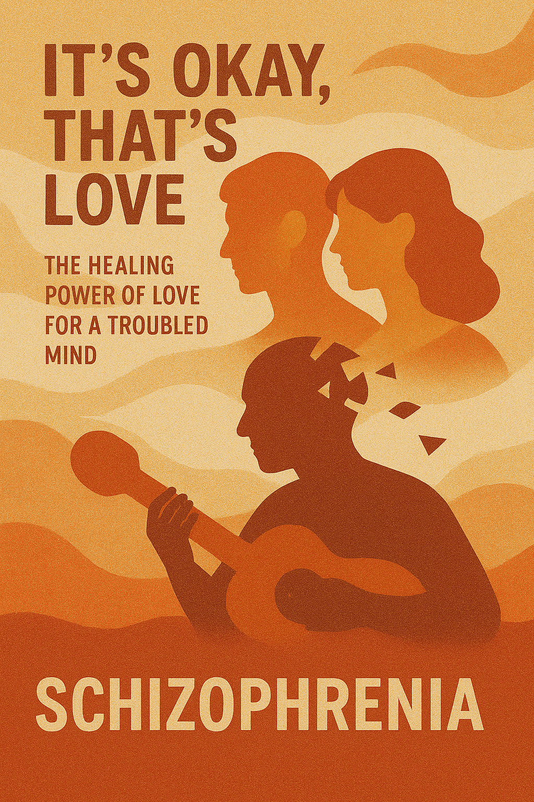
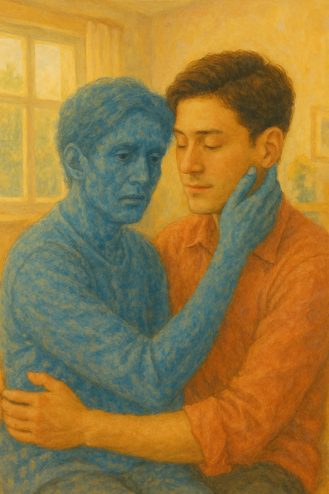

# It’s Okay, That’s Love(괜찮아, 사랑이야)

It is drama, created by Noh Hee-kyung.

This drama helped bring greater awareness to schizophrenia. It gently portrays the journey of a protagonist who learns to accept their diagnosis, undergoes treatment, and gradually overcomes personal challenges.

'It’s Okay, That’s Love' is a song that reveals the hearts of those parties well. It shows that even the most ordinary people may live their lives without recognizing their own emotional illness. This song flows out of the scene where the main characters silently confess their true feelings, and it can be seen that it is a song that reveals the meaning that love is not about changing the other person, but about staying with that person's pain.

The simple melody contrasts with the chaotic inner world of those with schizophrenia, while the music provides a sense of stability and warmth. This aligns with the drama’s narrative, where the protagonist (Jang Jae-yeol) gradually accepts his condition, and the people around him offer comfort and support for his pain.

[*>>MV*](https://youtu.be/nXHvDDLiANA?si=tToWB-265Wro4KKu) This video provides a deeper understanding by presenting scenes from the drama alongside the song in the form of a music video.

Example: There are similarities with my data in that it is a ballad OST for Korean drama called [*Doctor Slump*](bae_sangjun.md). Both works portray psychological suffering not merely as a pathological condition, but as something that can be healed through emotional connections, empathy, and love between people.

 

# 나의 장례식에서 연주되길 희망하는 음악

[*Clair de lune*](https://youtu.be/97_VJve7UVc?si=7ZnqnlKiKg29WKGM) 이 곡은 피아니스트 조성진이 연주한 드뷔시의 달빛이라는 곡이다. 가사도 없는 피아노 연주곡이지만, 오로지 선율 그 자체만으로도 많은 감정과 의미를 전달해 줄 수 있는 음악이라고 생각한다. 많은 이들이 이를 들으면 '마음이 편안해진다', '차분하다', '아름답다' 등의 평을 남기곤 하지만 나에겐 왠지모를 울컥하는 감정을 안겨주는 곡이기도 하다. 피아노를 연주하는 행위에 대해 무상함을 느끼던 시기에 엄마가 처음으로 내가 특정 곡을 연주해주길 원하셨고 그게 바로 '달빛'이었다. 내 연주를 들으며 행복해하시는 얼굴이 아직도 잊혀지지 않기에, 만약 내 장례식에 우리 가족 구성원 중 누구라도 자리하게 된다면 이 음악이 나와의 행복했던 기억을 되새길 수 있는 자그마한 통로를 만들어줄 수 있을 것 같다.

 # 나의 질병서사

 
 [*>>Playlist*](https://youtube.com/playlist?list=PLvwfbZkF1ZlWlIoqicoyi7GpdtZnlmhs5&si=tBuE3Gxnw90GUgaa) 내게 있어 질병 서사는 사랑을 느끼게 된 계기들과 뗄레야 뗄 수 없는 것이다. 나는 어렸을 적 약한 위장으로 인해 매년 병치레를 했다. 특히나 겨울만 되면 꼭 한 번씩은 배탈이 심하게 나 밤중에 응급실에 가곤 했다. 어릴 적부터 중학교 시절까진 집에서 부모님과 함께 지냈기에 내가 밤마다 아플 때면 항상 내 곁에는 날 돌봐줄 부모님이 계셨다. 아픈 날 데리고 오밤 중에 응급실에 다녀와선 쉬지도 못하고 밤새 이마를 만져보며 열이 떨어지긴할련지, 속은 괜찮은지, 미음도 먹지 못할 때면 따뜻한 차라도 끓여주시던 부모님의 사랑이 항상 바로 옆에 머물렀었다. 
 
처음으로 그 사랑의 크기를 깨달은 건 고등학교 시절 학교에서였다. 기숙사 생활을 하느라 부모님과도 떨어져 지냈고, 친구들 역시 공부하기에도 바빠 주변을 신경쓸 여력조차 없었다. 그런 순간에 위경련이 심하게 와 바로 옆에 친구들이 있었음에도 고통으로 인해 고개를 들지도, 입을 열 수 조차도 없었다. 

대학생이 되어 자취를 시작한 이후 한동안은 크게 아프지 않아 홀로 지내는 게 마냥 즐겁기만 했었다. 지난 겨울 갑작스레 몸이 으슬으슬하더니 가만히 누워있어도 열이 펄펄 끓어 어지러워 일어날 수도 없었고 가만히 누워있다보니 몸이 너무 아파 움직이고 싶을 지경에 이르렀는데 침대에 걸터 앉기만 해도 온 세상이 빙빙 돌았다. 원체 자주 아팠던 탓에 이 정도는 괜찮겠거니 했는데 새벽에 너무 극심한 통증이 느껴져 자려고 해도 도저히 잘 수 없었을 때, 밤새 간호해주시던 부모님 생각이 나기 시작했다. 물론 다 나은 뒤엔 금방 원래대로 돌아왔지만, 3일 내내 먹은 거라곤 죽 한 그릇이 전부여서 그새 4키로가 빠졌을 때도 아무도 몰랐다는 게 서글프기도 했다.

되돌아보니 ‘두 딸 모두 타지 생활을 하고 직장에 다니시는 아빠가 퇴근하시기 전까지 낮 동안 집에 혼자 계신 엄마를 돌봐줄 사람이 없었겠구나.’, ‘어쩌면 엄마도 아플 때마다 엄마의 엄마가 떠오르시지 않을까?’ 하는 생각들이 떠오르면서 괜히 가슴이 저려왔다.

말로 뱉는 표현들만이 사랑이 아님을 지나고나서야 깨달았음에 죄송하기도 하고 이제라도 깨달았으니 나도 다시 그런 마음을 베풀 수 있는 사람이 되어야겠다는 다짐을 한다.
